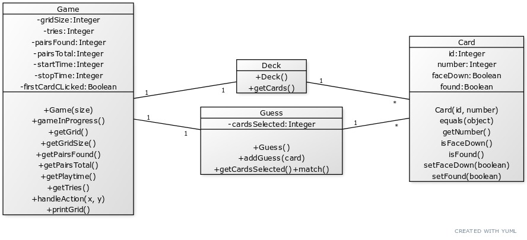
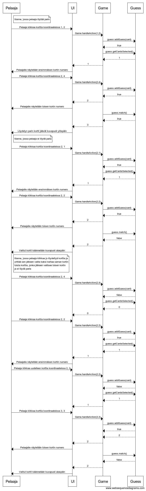

# Arkkitehtuurikuvaus

## Pakkaukset

Sovelluksen rakenne koostuu viidestä eri pakkauksesta *data*, *logics*, *main*, *service* ja *UI*

### Memorygame.data

Pakkaus *data* sisältää pelituloksen tallentamiseen ja tietokantayhteyksiin liittyvät luokat *Score*, *ScoreDao*, *SqlScoreDao* ja *dbConnection*

#### SQLite JDBC

Sovellus käyttää tietokantaan tallentamisessa Maven kirjastoa **SQlite JDBC 3.31.1**

### Memorygame.logics

Pakkaus *logics* sisältää muistipelin käsitteellistävät luokat *Card* ja *Deck*, sekä pelin logiikasta vastaavat luokat *Game* ja *Guess*

#### Luokkakaavio pakkauksesta memorygame.logics



### Memorygame.main

Pakkaus *main* sisältää vain main-metodin sisältävän luokan *Main*

### Memorygame.UI

Pakkaus *UI* sisältää käyttöliittymästä vastaavan *Memorygame.UI*-luokan

#### JavaFX

Käyttöliittymän piirtämiseen sovellus käyttää Maven kirjastoa **OpenJFX 12.0.2**

### Pelin logiikka yksinkertaistettuna
 
 - Pelaajalle näytetään UI:ssa alkuvalikko
 - Pelaaja valitsee ruudukon leveyden ja korkeuden
 - Pelaaja aloittaa uuden pelin
 - UI alustaa olion *game* kutsumalla *Game*-luokan konstruktria *Game(int gridSizeX, int gridSizeY)*
 - Konstruktori alustaa uuden pelin
 - UI pyytää gameoliolta ruudukon getterillä *getGrid()*
 - UI piirtää pelitilannetta käyttäjälle *drawBoard()* privaattimetodillaan
 - Pelaajaan valitessa palan käännettäväksi valinta viedään logiikasta vastaavalle *Game*-luokalla kutsumalla sen metodia *handleAction(int x, int y)*
 - *handleAction* vie valinnan tuloksen UI:lle palauttamalla kokonaisluvun 1, 2 tai 3. 1-2 = valittujen korttien lukumäärä, 3 = löytyi pari.
 
```java
	//checking if all pairs are found
	if (!game.gameInProgress()) {
		showGameEndWindow(stage);
	}
```
- UI tarkistaa jokaisen valinnan jälkeen onko peli käynnissä ja jos peli on päättynyt UI näyttää ikkunan, jossa pelin tulos (arvausten määrä, käytetty aika, monellako parilla pelattiin)
- UI näyttää nykyisen toplistan vastaavalla parien määrällä pelatuista peleistä ja kysyy pelaajan nimeä tuloksen tallentamista varten

#### Sekvenssikaavio palojen kääntämisen logiikasta


