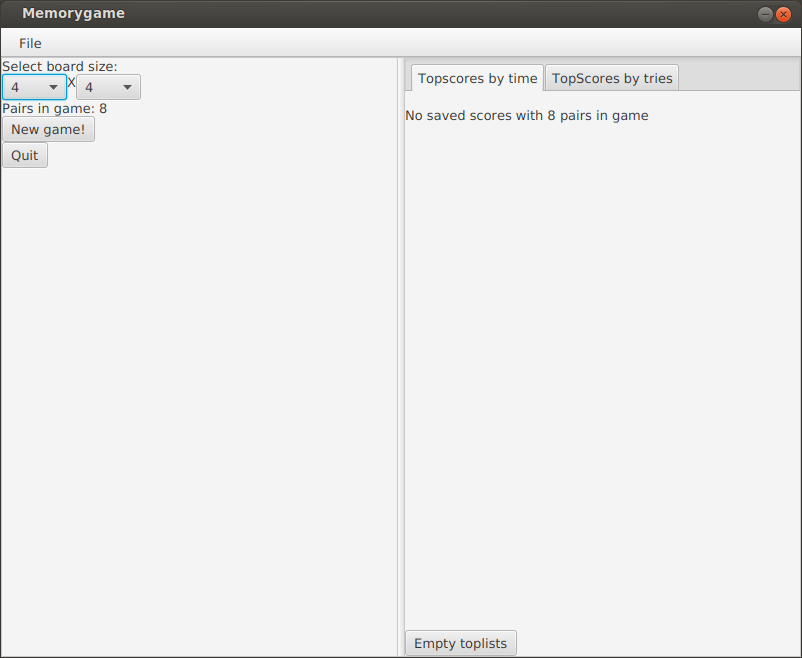
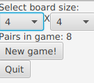
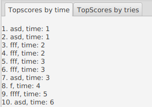
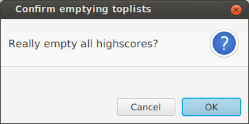
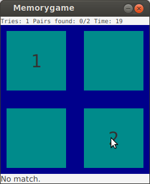
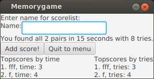

# Käyttöohje

## Alkutoimet

### Lataa peli

[Memorygame.jar](https://github.com/jussmaki/ot-harjoitustyo/releases/download/final/Memorygame.jar)

### Käynnistä peli 

```
java -jar Memorygame.jar
```

## Alkuvalikossa



### Ruudukon koon ja parien määrän valinta



Alkuvalikossa voit valita haluamasi pelilaudan koon. Valittuasi ruudukon koon pudotusvalikosta parien määrä päivittyy automaattisesti.

### Toplistat



Oikeassa reunassa näet kulloistenkin parien määrän mukaiset toplistat eri välilehdillä arvausten ja ajan mukaan järjestettynä.


Painamalla *Empty toplists* -painiketta voit poistaa kaikki tallennetut pelitulokset.



Sovellus kysyy varmistuksen, ennen kuin tallennetut tiedot poistetaan.

### Uuden pelin aloitus

Uuden pelin voi aloittaa klikkaamalla *New game*-painiketta tai valitsemalla *File*-valikosta *New game*.

## Pelissä

### Parin arvaus

Pareja arvataan klikkaamalla tummanvihreitä alueita hiirellä. 



Peli-näkymän alalaitaan tulee näkyviin kulloisenkin pelitilanteen mukaisia ohjeita.

### Tuloksen tallennus

Peli päättyy kun olet löytänyt kaikki parit.



Peli näyttää nykyiset parhaat pelitukset valitulle parien määrälle ja kysyy pelaajan nimeä tuloksen tallennusta varten. Tulosta ei ole pakko tallentaa, kyselystä voi poistua painamalla *Quit to menu*. Annettu nimi jää muistiin, sovelluksen suorituskerran loppuun asti.

## Muuta

### Ensimmäisellä käynnistyskerralla

Peli luo ensimmäisellä käynnistyskerralla tiedostot *dbconfig.properties* ja *scores.db*. Tiedosto *scores.db* on tietokantatiedosto pelin tulosten tallentamista varten. 

```
db.driver=org.sqlite.JDBC
db.file=scores.db
```

### Oletuskonfiguraation muuttaminen

Tiedosto *dbconfig.properties* sisältää tietokantatiedoston nimen ja tietokantayhteyden muodostamisessa käytettävän ajurin. Muuttamalla tiedoston sisältöä voit vaihtaa nämä haluamiksesi.
