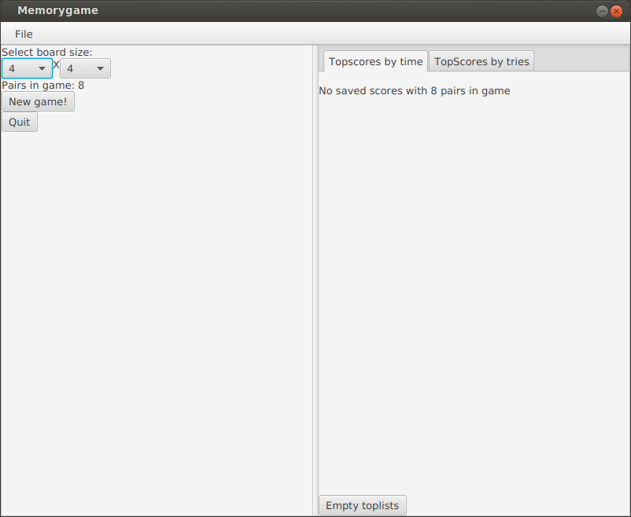

# Vaatimusmäärittely

## Sovelluksen tarkoitus

Sovellus on perinteinen muistipeli. Pelissä käyttäjän on tarkoitus mahdollisimman vähän aikaa käyttäen löytää kaikki parin muodostavat palat mahdollisimman pienellä määrällä yrityksiä. Peli pitää tuloksista kirjaa. Pelaajan on mahdollista valita parien määrä ja katsoa parhaat tulokset käytetyn ajan tai arvausyritysten määrän mukaan järjestettynä. 

## Käyttöliittymä

Alkuvalikko: näkymä, jossa pelaaja voi valita uuden pelin asetukset, katsoa toplistoja ja aloittaa uuden peli.

Peli: näkymä, jossa itse peli tapahtuu.

## Toiminnallisuudet

### Toiminnallisuudet alkuvalikossa

- pelaaja voi valita pelilaudan koon (parien määrän)

- pelaaja voi aloittaa uuden pelin

- pelaaja voi katsoa toplistoja

- pelaaja voi tyhjentää toplistat

### Toiminnallisuudet pelissä

- palojen valinta ja parien arvaaminen

- pelaajalle näytetään erilaista statistiikkaa pelin kulusta: arvausten määrä, löydetyt parit ja kulunut aika.
 
- pelin päätyttyä pelin tuloksen tallennus
